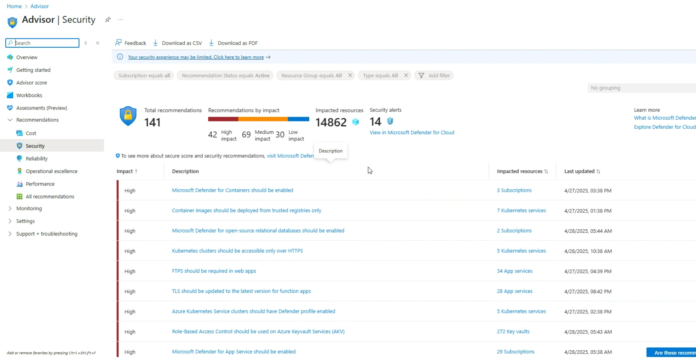

# PolicyExamptAutomation
Azure Security Center – Policy Exemption Automation
# Azure Security Center – Policy Exemption Automation

This repository provides a PowerShell-based solution that helps organizations clean up **non-relevant or false-positive recommendations** from Microsoft Defender for Cloud's default policy initiative (`securitycenterbuiltin`). By using Azure Policy Exemptions, this script improves your Secure Score by focusing only on relevant, actionable security items.

---

## 🚀 What This Does

- Applies **policy exemptions** to specific recommendations across all subscriptions in a tenant.
- Targets the built-in initiative: **securitycenterbuiltin** (Microsoft Defender for Cloud default).
- Uses the **Azure Policy Exemptions API** (`2022-07-01-preview`) to automate exemption creation.
- Improves Secure Score by removing noise from non-applicable recommendations.

---

## 🧩 Why Use This?

Microsoft Defender for Cloud (ASC) evaluates your environment against a broad set of security recommendations. However, some recommendations might not be applicable to your workloads or organization. This can result in:

- False positives
- Non-actionable findings
- Artificially low Secure Scores

This script helps you mitigate these issues by allowing you to exempt the recommendations that don't apply.

---

## 📌 Example Use Cases

| Scenario | Recommendation You Might Want to Exempt |
|----------|-------------------------------------------|
| You're using Windows VMs without Exploit Guard | `windowsDefenderExploitGuardMonitoring` |
| You require multiple Owners due to DevOps tooling | `identityDesignateLessThanOwnersMonitoring` |
| You don't use SQL Managed Instances | `sqlManagedInstanceAdvancedDataSecurityMonitoring` |
| You run classic resources temporarily | `classicComputeVMsMonitoring` |
| You use TLS 1.2 for legacy systems | `latestTLSVersionShouldBeUsedInYourWebAppMonitoringEffect` |
| Defender for APIs is not used | `enableDefenderForApis` |

---

## 🔧 How to Use

 1. Configure Your Tenant
Edit the script to set your Azure tenant ID:

```powershell
$tenantId = '<your-tenant-id>'

 2. Choose Which Recommendations to Exempt
Open the file exempted-policy-ids.json, which includes a list of policyDefinitionReferenceIds and their display names.

Important: Only include the IDs of recommendations that are not relevant to your environment.

Example format:

json
Copy
Edit
{
  "windowsDefenderExploitGuardMonitoring": "Windows machines should have Exploit Guard enabled",
  "classicComputeVMsMonitoring": "Classic compute VMs should be migrated to ARM"
}

3. Run the Script
powershell
Copy
Edit
.\create-policy-exemptions.ps1
The script will:

Loop through each subscription in your tenant

Check if the securitycenterbuiltin assignment exists

Create an exemption with category Mitigated for the selected policies

| File                           | Description                                                           |
| ------------------------------ | --------------------------------------------------------------------- |
| `create-policy-exemptions.ps1` | Main script that applies policy exemptions                            |
| `exempted-policy-ids.csv`     | Editable list of policyDefinitionReferenceIds and their display names |
| `README.md`                    | Documentation and usage guide                                         |


📚 References
Azure Policy Exemptions documentation - https://learn.microsoft.com/en-us/azure/governance/policy/concepts/exemption-structure

Microsoft Defender for Cloud Secure Score - https://learn.microsoft.com/en-us/azure/defender-for-cloud/secure-score-security-controls



